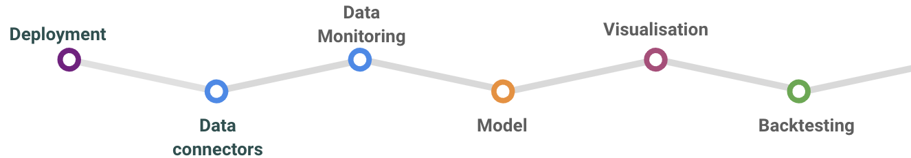

.. tshistory_refinery documentation master file, created by
   sphinx-quickstart on Thu Dec 29 11:48:28 2022.
   You can adapt this file completely to your liking, but it should at least
   contain the root `toctree` directive.

The Timeseries Refinery
==============================================

The Timeseries Refinery is a tool that :

- Store **versioned timeseries data** (time travel capacity), provide fine-tuned backtesting capacity, ease data monitoring
- **Centralize** data from various sources: internal data silos - external APIs Data queries on the fly or scraped on schedule
- **Automate** data processes (ETL, predictions, computations, sanity checks, …)
- **Aggregate** and **transform** timeseries with formulas
- Build a common **catalog** -> shared (high level, cured) data referential

.. toctree::
   :maxdepth: 2
   :caption: Content

   usage
   api
   formula
   rework
   supervision

